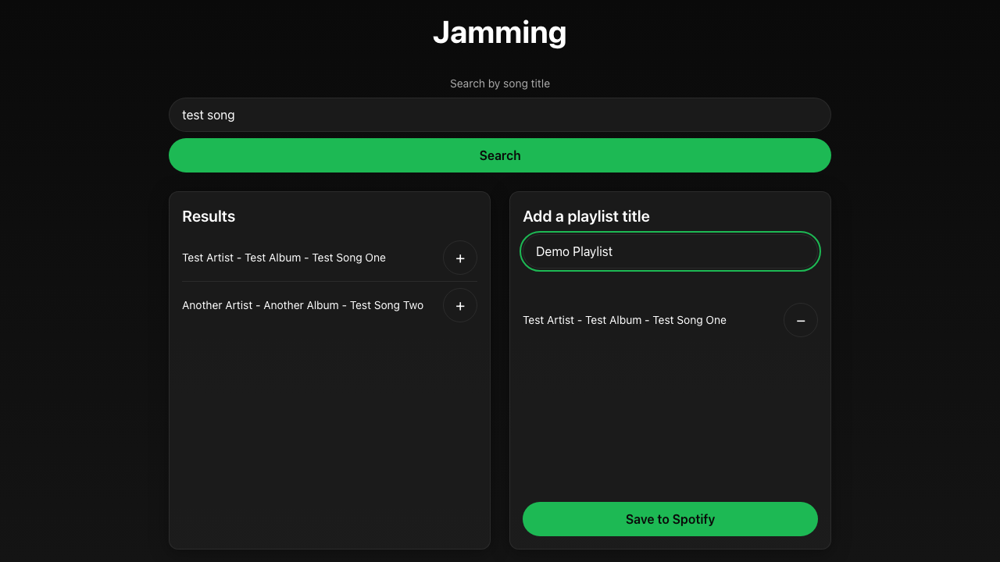
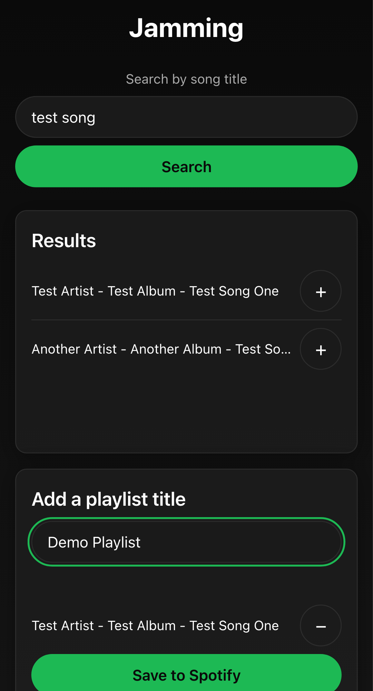
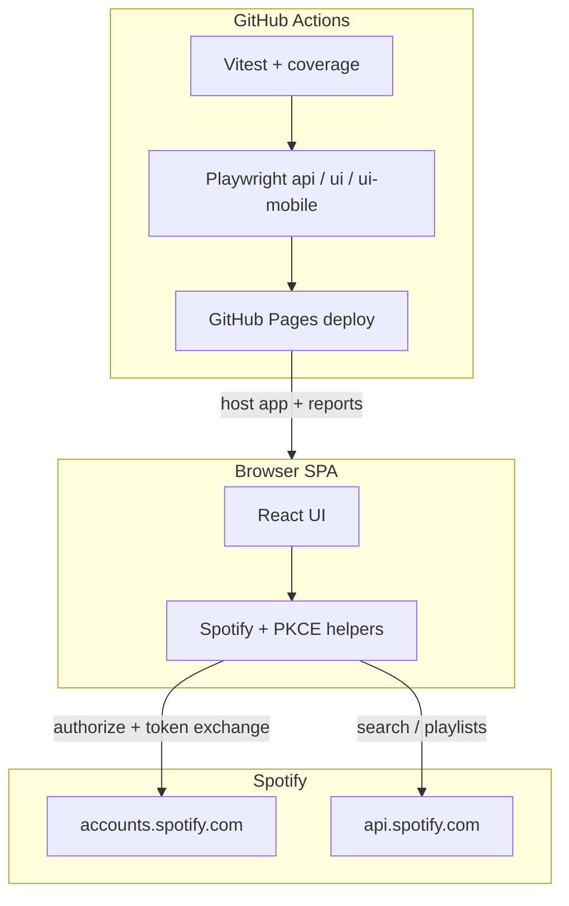
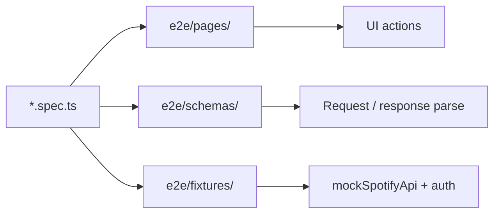
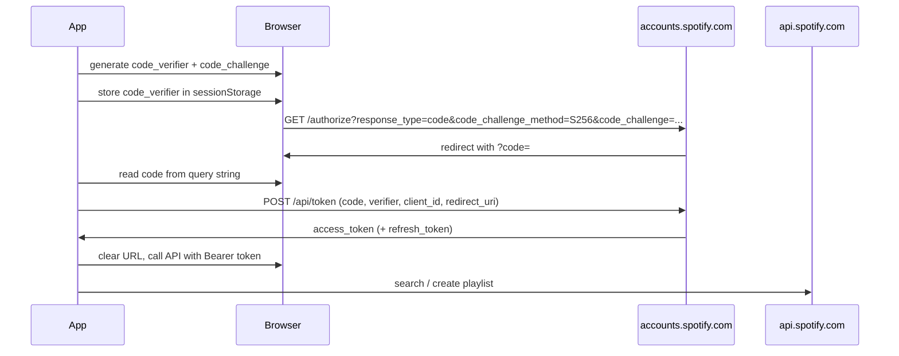

# Jammming

[](https://github.com/solcala/cc_jammming_music/actions/workflows/deploy.yml)
[](https://solcala.github.io/cc_jammming_music/reports/index.html)
[](https://vitejs.dev/)
[](https://www.typescriptlang.org/)
[](https://vitest.dev/)
[](LICENSE)

Search the Spotify catalog, build a playlist in the browser, and save it to your Spotify account.

**Live app:** [https://solcala.github.io/cc_jammming_music/](https://solcala.github.io/cc_jammming_music/)  
**Playwright report (after successful `main` deploy):** [https://solcala.github.io/cc_jammming_music/reports/index.html](https://solcala.github.io/cc_jammming_music/reports/index.html)  
**Contributing:** see [CONTRIBUTING.md](CONTRIBUTING.md)

## Screenshots

| Desktop | Mobile |
| --- | --- |
|  |  |

## Features

- Search tracks by title using the Spotify Web API
- Preview track name, artist, and album in a compact dark UI
- Add and remove tracks from a playlist
- Name your playlist and save it to Spotify via Authorization Code + PKCE
- Mobile-first layout with dedicated Playwright mobile smoke tests

## Architecture



High-level auth flow (PKCE) is documented in [Spotify authentication (PKCE)](#spotify-authentication-pkce).

## Tech stack

| Area | Choice |
| --- | --- |
| UI | React 18 |
| Bundler / dev server | Vite 5 |
| Language | TypeScript 5 |
| Unit tests | Vitest + React Testing Library + `@vitest/coverage-v8` |
| E2E | Playwright (`api`, `ui`, `ui-mobile`) |
| Lint | ESLint 9 flat config |
| Auth | Spotify Authorization Code + PKCE (public client, no secret in the browser) |
| CI / CD | GitHub Actions → GitHub Pages |
| Hosting path | `/cc_jammming_music/` |

## Prerequisites

- Node.js 18+ (Node 20 recommended for CI parity)
- A [Spotify Developer](https://developer.spotify.com/dashboard) application with a registered redirect URI

## Setup

1. Clone the repository and install dependencies:

    ```bash
    git clone https://github.com/solcala/cc_jammming_music.git
    cd cc_jammming_music
    npm install
    ```

2. Copy the environment template and fill in your Spotify credentials:

    ```bash
    cp .env.example .env
    ```

    Edit `.env` with your `VITE_SPOTIFY_CLIENT_ID` and `VITE_REDIRECT_URI`.

3. Start the development server:

    ```bash
    npm start
    ```

Open [http://127.0.0.1:3000/cc_jammming_music/](http://127.0.0.1:3000/cc_jammming_music/) in your browser (Spotify does not allow `localhost` redirect URIs).

## Available Scripts

| Script | Description |
| --- | --- |
| `npm start` | Start the Vite development server |
| `npm test` | Run Vitest unit tests in watch mode |
| `npm run build` | Build for production to `dist/` |
| `npm run preview` | Preview the production build locally |
| `npm run test:e2e` | Run Playwright E2E tests against the Vite dev server |
| `npm run test:e2e:ci` | Build for E2E, then run Playwright against `dist/` |
| `npm run test:e2e:serve` | Run Playwright against an existing `dist/` (CI uses this after downloading the build artifact) |
| `npm run test:coverage` | Run Vitest unit tests with coverage report |
| `npm run test:all` | Run Vitest coverage, production build, and Playwright CI tests (full local check) |
| `npm run lint` | Run ESLint on `src/` and `e2e/` |
| `npm run typecheck` | Run TypeScript checks for `src/`, config files, and `e2e/` |
| `npm run test:api` | Run Playwright API tests only |
| `npm run test:ui` | Run Playwright desktop UI tests only |
| `npm run test:ui:mobile` | Run Playwright mobile UI smoke tests (`Pixel 5` viewport, Chromium) |
| `npm run test:e2e:ui` | Open the Playwright test UI |

## Testing

Quality standards for this repo are documented in:

- [`.cursor/rules/qa-testing-standards.mdc`](.cursor/rules/qa-testing-standards.mdc) — API contracts, Playwright POM, clean tests, mock audit comments
- [`.cursor/rules/e2e-tests.mdc`](.cursor/rules/e2e-tests.mdc) — Playwright-specific style
- [`CONTRIBUTING.md`](CONTRIBUTING.md) — contributor testing checklist

`npm run lint` also runs `scripts/qa-test-guards.mjs`, which fails if `waitForTimeout` appears under `e2e/` or `expect(` appears under `e2e/pages/`.

### Layout (E2E)

```text
e2e/
  pages/           # Page objects (selectors + actions only — no assertions)
  schemas/         # Zod Spotify request/response contracts
  fixtures/        # Mocks, auth bootstrap, request-tracking helpers
  api/             # API reconciliation specs
  ui/              # Desktop UI specs
  ui/mobile/       # Mobile smoke specs
```



### Contract-first + reconciliation

This app is a browser-only SPA with **no database**. “Reconciliation” means:

1. Validate outbound Spotify traffic (method, URL/query, body, auth) — often with Zod parsers in `e2e/schemas/`
2. Assert the matching UI outcome via `data-testid`

Default Spotify routes stay mocked for CI speed. Synthetic edge cases (401, 500, delayed responses) must include a `// [QA_AUDIT_REQUIRED]: ...` justification.

### Unit Tests (Vitest)

```bash
npm test
```

### End-to-End Tests (Playwright)

Playwright tests mock all Spotify API calls, so no credentials are required. Specs use page objects under `e2e/pages/`; assertions stay in `*.spec.ts`.

**Local development** (Vite dev server at `/cc_jammming_music/`):

```bash
npx playwright install chromium
npm run test:e2e
```

**Mobile smoke tests** (Pixel 5 viewport, critical flows only):

```bash
npm run test:ui:mobile
```

**CI / production build** (serves `dist/` at the GitHub Pages subpath):

```bash
npm run test:e2e:ci
```

**Docker** (same image as CI — keep in sync with `@playwright/test` in `package.json`):

```bash
npm run build
docker run --rm --ipc=host -v "$PWD":/app -w /app mcr.microsoft.com/playwright:v1.61.1-jammy npm run test:e2e:ci
```

See [`docker/playwright.Dockerfile`](docker/playwright.Dockerfile) for the pinned image reference. When upgrading `@playwright/test`, update both the Docker image tag and the Dockerfile to the matching Playwright release.

### Unit test coverage

```bash
npm run test:coverage
```

Report output is written to `coverage/`. Open `coverage/lcov-report/index.html` locally for the HTML report.

**Node version note:** CI uses Node 20. Vitest coverage works reliably on Node 20. On Node 24, if coverage collection fails due to a `test-exclude` / `minimatch` issue, use Node 20 locally for `npm run test:coverage`.

### Full local test suite

Runs the same checks as CI before Playwright (coverage + build + e2e against production `dist/`):

```bash
npm run test:all
```

This runs `test:coverage`, then `build:e2e`, then `test:e2e:serve`.

### Dependency updates

[Dependabot](https://docs.github.com/en/code-security/dependabot) opens weekly pull requests for npm packages and GitHub Actions (see [`.github/dependabot.yml`](.github/dependabot.yml)). Review security alerts on the repository **Security** tab and merge Dependabot PRs after CI passes.

**Merge tips:**

- Prefer **small, focused** Dependabot PRs over large grouped bumps.
- The grouped `development-dependencies` PR excludes toolchain packages such as `eslint` and `typescript` so they can be upgraded deliberately.
- Do **not** merge mega-bumps that combine major ESLint + TypeScript + Vite upgrades in one PR — upgrade them one at a time and run `npm run test:all` after each.

## Deployment

The project deploys to GitHub Pages via a unified CI workflow ([`.github/workflows/deploy.yml`](.github/workflows/deploy.yml)) that runs on every `pull_request` and on `push` to `main`.

### CI pipeline

The workflow runs five jobs on every `pull_request` and `push` to `main`:

| Job | Runner | Steps |
| --- | --- | --- |
| `build_and_unit` | `ubuntu-latest` | `npm ci` → lint → typecheck → Vitest with coverage → Vite production build → upload `dist/`, `coverage/`, and test summary artifacts |
| `e2e` | Playwright Docker (`v1.61.1-jammy`) | Download `dist/` → `npm run test:e2e:serve` → upload Playwright report and e2e summary |
| `deploy` | `ubuntu-latest` | Embed report in `dist/reports/` → deploy to GitHub Pages (only on successful `main` push) → upload deploy summary |
| `publish_failure_traces` | `ubuntu-latest` | On e2e failure only: copy `trace.zip` files to `failures/<run_id>/` on GitHub Pages so trace viewer links work without auth |
| `notify` | `ubuntu-latest` | Merge job summaries → post Slack notification (`if: always()`) |

E2E tests run against the production `dist/` (not the Vite dev server), matching the deployed GitHub Pages subpath.

### CI artifacts and reports

Every workflow run publishes downloadable artifacts and a job summary on the Actions run page:

| Artifact | Job | Contents |
| --- | --- | --- |
| `coverage` | `build_and_unit` | Vitest HTML and LCOV report (`coverage/`) |
| `playwright-report-<run_id>` | `e2e` | Playwright HTML report and test traces |
| `dist` | `build_and_unit` | Production build passed to E2E and deploy |

- **Unit test coverage %** — shown in the `build_and_unit` job summary
- **Playwright report (live)** — embedded at `/reports/` after a successful `main` deploy (see Live URLs below)
- **Failed runs** — download the Playwright report from **Artifacts** on the run page; deploy is skipped until all jobs pass

### Live URLs

| Resource | URL |
| --- | --- |
| App | [https://solcala.github.io/cc_jammming_music/](https://solcala.github.io/cc_jammming_music/) |
| Playwright report (after successful deploy) | [https://solcala.github.io/cc_jammming_music/reports/index.html](https://solcala.github.io/cc_jammming_music/reports/index.html) |
| Actions / CI | [https://github.com/solcala/cc_jammming_music/actions](https://github.com/solcala/cc_jammming_music/actions) |

### Slack CI notifications

After each workflow run, the `notify` job merges results from `build_and_unit`, `e2e`, and `deploy` (waiting for `publish_failure_traces` when e2e fails) and posts a summary to Slack (when configured).

#### **What gets posted**

- Green or red header based on overall pass/fail
- Branch, event type, and total passed / failed / skipped counts
- Per-job breakdown: unit tests (with line coverage %), Playwright E2E tests, and deploy status
- On Playwright E2E failure: failed test names, links to open traces in [trace.playwright.dev](https://trace.playwright.dev), and a link to download the HTML report artifact from the Actions run (traces are published to `https://solcala.github.io/cc_jammming_music/failures/<run_id>/` by the `publish_failure_traces` job)
- Link to the GitHub Actions run

On pull requests, deploy is skipped — the Slack message still reports test results with deploy marked as skipped.

#### **One-time setup**

1. In Slack, create an [Incoming Webhook](https://api.slack.com/messaging/webhooks) for your channel.
2. In GitHub, go to **Settings → Secrets and variables → Actions** and add a repository secret named `SLACK_WEBHOOK_URL` with the webhook URL.

If the secret is not set, the `notify` job logs a warning and exits successfully — CI is not blocked.

##### **Local dry-run**

Use a sample report to preview the Slack message without running the full pipeline:

```bash
SLACK_WEBHOOK_URL=https://hooks.slack.com/services/YOUR/WEBHOOK/URL \
  node scripts/send-slack-report.js --report scripts/sample-slack-report.json
```

A failure example is in [`scripts/sample-slack-report-failure.json`](scripts/sample-slack-report-failure.json). You can also set `SLACK_WEBHOOK_URL` in `.env` for local use (see [`.env.example`](.env.example)); never commit a real webhook URL.

### Spotify configuration for production

Set `VITE_REDIRECT_URI` to `https://solcala.github.io/cc_jammming_music/` and register that exact URI in your [Spotify Developer Dashboard](https://developer.spotify.com/dashboard).

For live Spotify login on the deployed app, add a GitHub repository secret named `VITE_SPOTIFY_CLIENT_ID` with your Spotify client ID. The workflow also accepts the legacy `REACT_APP_SPOTIFY_CLIENT_ID` secret name during migration. Without a client ID secret, the app still renders; only Spotify authentication will not work in production.

Use a **public** Spotify app (no client secret). PKCE is designed for browser-only clients; the same `VITE_SPOTIFY_CLIENT_ID` and `VITE_REDIRECT_URI` variables apply.

#### Spotify Developer Dashboard setup

1. Open [developer.spotify.com/dashboard](https://developer.spotify.com/dashboard) and select your app (or create one).
2. Under **Settings**, confirm the app is a **Web API** client. Do not embed a client secret in this SPA — PKCE uses the public client ID only.
3. Under **Redirect URIs**, add every URL the app runs on. Each entry must match `VITE_REDIRECT_URI` **exactly** (scheme, host, path, trailing slash):

    | Environment | `VITE_REDIRECT_URI` |
    | --- | --- |
    | Local dev (`npm start`) | `http://127.0.0.1:3000/cc_jammming_music/` |
    | GitHub Pages (production) | `https://solcala.github.io/cc_jammming_music/` |

    Spotify no longer accepts `localhost` redirect URIs. Use `127.0.0.1` and open the app at that same address in your browser (not `http://localhost:...`), so the PKCE session survives the OAuth redirect.

4. Save settings. Spotify redirects back with `?code=` in the query string after login — not `#access_token=` in the hash.
5. Copy the **Client ID** into `.env` locally (`VITE_SPOTIFY_CLIENT_ID`) and into the `VITE_SPOTIFY_CLIENT_ID` GitHub Actions secret for production builds.

Playwright e2e tests mock the `/api/token` exchange and bootstrap a PKCE callback URL — no real Spotify login is required in CI.

## Spotify authentication (PKCE)

The app uses Spotify **Authorization Code with PKCE** — the recommended pattern for browser-only SPAs. No client secret is stored or sent; only the public client ID is used.

After login, Spotify redirects to `VITE_REDIRECT_URI?code=...` (query string). The app exchanges that code for an access token via [`src/util/pkce.ts`](src/util/pkce.ts) and [`src/util/Spotify.ts`](src/util/Spotify.ts).

### PKCE flow



| Step | What happens |
| --- | --- |
| 1 | Generate a random `code_verifier` (43–128 chars) and derive `code_challenge` = BASE64URL(SHA256(verifier)). |
| 2 | Save `code_verifier` in `sessionStorage` under `spotify_pkce_code_verifier`. |
| 3 | Redirect to `https://accounts.spotify.com/authorize` with `response_type=code`, `code_challenge_method=S256`, `code_challenge`, `client_id`, `redirect_uri`, and `scope=playlist-modify-public`. |
| 4 | After login, Spotify redirects to `VITE_REDIRECT_URI?code=...` (query string, not hash). |
| 5 | Exchange the `code` at `https://accounts.spotify.com/api/token` with `grant_type=authorization_code`, `code_verifier`, `client_id`, and `redirect_uri`. |
| 6 | Store the access token in memory; optionally persist refresh token for silent renewal in a later iteration. |
| 7 | Replace the URL with `import.meta.env.BASE_URL` so the authorization code is not left in the address bar. |

Low-level helpers live in [`src/util/pkce.ts`](src/util/pkce.ts). [`src/util/Spotify.ts`](src/util/Spotify.ts) uses them for login, token exchange, and API calls.

### Spotify Dashboard checklist

1. App type: **Web API** public client (no client secret in the browser).
2. **Redirect URIs**: register both local and production URLs exactly (see table above).
3. Env vars: `VITE_SPOTIFY_CLIENT_ID`, `VITE_REDIRECT_URI` (must match a registered redirect URI).

## License

This project is licensed under the [MIT License](LICENSE).
