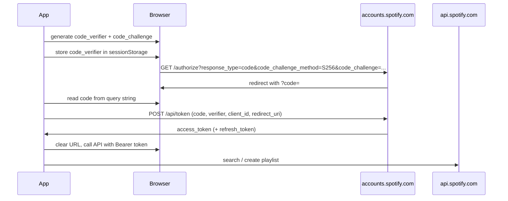

# Jammming

A React web application that lets you search the Spotify catalog, build custom playlists, and save them directly to your Spotify account.

## Features

- Search tracks by title using the Spotify Web API
- Preview track name, artist, and album
- Add and remove tracks from a playlist
- Name your playlist and save it to Spotify

## Prerequisites

- Node.js 18+
- A [Spotify Developer](https://developer.spotify.com/dashboard) application with a registered redirect URI

## Setup

1. Clone the repository and install dependencies:

```bash
git clone https://github.com/solcala/cc_jammming_music.git
cd cc_jammming_music
npm install
```

2.Copy the environment template and fill in your Spotify credentials:

```bash
cp .env.example .env
```

Edit `.env` with your `REACT_APP_SPOTIFY_CLIENT_ID` and `REACT_APP_REDIRECT_URI`.

3.Start the development server:

```bash
npm start
```

Open [http://localhost:3000](http://localhost:3000) in your browser.

## Available Scripts

| Script | Description |
| --- | --- |
| `npm start` | Start the development server |
| `npm test` | Run Jest unit tests in watch mode |
| `npm run build` | Build for production to `build/` |
| `npm run test:e2e` | Run Playwright E2E tests against the CRA dev server |
| `npm run test:e2e:ci` | Run Playwright E2E tests against the production `build/` |
| `npm run test:coverage` | Run Jest unit tests with coverage report |
| `npm run test:all` | Run Jest coverage, production build, and Playwright CI tests (full local check) |
| `npm run lint` | Run ESLint on `src/` and `e2e/` |
| `npm run test:api` | Run Playwright API tests only |
| `npm run test:ui` | Run Playwright UI tests only |
| `npm run test:e2e:ui` | Open the Playwright test UI |

## Testing

### Unit Tests (Jest)

```bash
npm test
```

### End-to-End Tests (Playwright)

Playwright tests mock all Spotify API calls, so no credentials are required.

**Local development** (CRA dev server):

```bash
npx playwright install chromium
npm run test:e2e
```

**CI / production build** (serves `build/` at the GitHub Pages subpath):

```bash
npm run build
npm run test:e2e:ci
```

**Docker** (same image as CI — keep in sync with `@playwright/test` in `package.json`):

```bash
npm run build
docker run --rm --ipc=host -v "$PWD":/app -w /app mcr.microsoft.com/playwright:v1.61.1-jammy npm run test:e2e:ci
```

See [`docker/playwright.Dockerfile`](docker/playwright.Dockerfile) for the pinned image reference. When upgrading `@playwright/test`, update both the Docker image tag and the Dockerfile to the matching Playwright release.

### Unit test coverage

```bash
npm run test:coverage
```

Report output is written to `coverage/`.

**Node version note:** CI uses Node 20. Jest coverage works reliably on Node 20. On Node 24, coverage collection may fail due to a `babel-plugin-istanbul` / `glob` compatibility issue with this Create React App setup (the repo pins `glob@^10` for security). Use Node 20 locally for `npm run test:coverage` if you hit that error.

### Full local test suite

Runs the same checks as CI before Playwright (coverage + build + e2e against production `build/`):

```bash
npm run test:all
```

This runs `test:coverage`, then `build`, then `test:e2e:ci`.

### Dependency updates

[Dependabot](https://docs.github.com/en/code-security/dependabot) opens weekly pull requests for npm packages and GitHub Actions (see [`.github/dependabot.yml`](.github/dependabot.yml)). Review security alerts on the repository **Security** tab and merge Dependabot PRs after CI passes.

## Deployment

The project deploys to GitHub Pages via a unified CI workflow ([`.github/workflows/deploy.yml`](.github/workflows/deploy.yml)) that runs on every `pull_request` and on `push` to `main`.

### CI pipeline

The workflow ([`.github/workflows/deploy.yml`](.github/workflows/deploy.yml)) runs five jobs on every `pull_request` and `push` to `main`:

| Job | Runner | Steps |
| --- | --- | --- |
| `build_and_unit` | `ubuntu-latest` | `npm ci` → Jest with coverage → production build → upload `build/`, `coverage/`, and test summary artifacts |
| `e2e` | Playwright Docker (`v1.61.1-jammy`) | Download `build/` → `npm run test:e2e:ci` → upload Playwright report and e2e summary |
| `deploy` | `ubuntu-latest` | Embed report in `build/reports/` → deploy to GitHub Pages (only on successful `main` push) → upload deploy summary |
| `publish_failure_traces` | `ubuntu-latest` | On e2e failure only: copy `trace.zip` files to `failures/<run_id>/` on GitHub Pages so trace viewer links work without auth |
| `notify` | `ubuntu-latest` | Merge job summaries → post Slack notification (`if: always()`) |

E2E tests run against the production `build/` (not the CRA dev server), matching the deployed GitHub Pages subpath.

### CI artifacts and reports

Every workflow run publishes downloadable artifacts and a job summary on the Actions run page:

| Artifact | Job | Contents |
| --- | --- | --- |
| `coverage` | `build_and_unit` | Jest HTML and LCOV report (`coverage/`) |
| `playwright-report-<run_id>` | `e2e` | Playwright HTML report and test traces |
| `build` | `build_and_unit` | Production build passed to E2E and deploy |

- **Jest coverage %** — shown in the `build_and_unit` job summary
- **Playwright report (live)** — embedded at `/reports/` after a successful `main` deploy (see Live URLs below)
- **Failed runs** — download the Playwright report from **Artifacts** on the run page; deploy is skipped until all jobs pass

### Live URLs

| Resource | URL |
| --- | --- |
| App | [https://solcala.github.io/cc_jammming_music/](https://solcala.github.io/cc_jammming_music/) |
| Playwright report (after successful deploy) | [https://solcala.github.io/cc_jammming_music/reports/index.html](https://solcala.github.io/cc_jammming_music/reports/index.html) |

Open `coverage/lcov-report/index.html` locally after `npm run test:coverage` for the Jest HTML report.

### Slack CI notifications

After each workflow run, the `notify` job merges results from `build_and_unit`, `e2e`, and `deploy` (waiting for `publish_failure_traces` when e2e fails) and posts a summary to Slack (when configured).

#### **What gets posted**

- Green or red header based on overall pass/fail
- Branch, event type, and total passed / failed / skipped counts
- Per-job breakdown: Jest unit tests (with line coverage %), Playwright E2E tests, and deploy status
- On Playwright E2E failure: failed test names, links to open traces in [trace.playwright.dev](https://trace.playwright.dev), and a link to download the HTML report artifact from the Actions run (traces are published to `https://solcala.github.io/cc_jammming_music/failures/<run_id>/` by the `publish_failure_traces` job)
- Link to the GitHub Actions run

On pull requests, deploy is skipped — the Slack message still reports test results with deploy marked as skipped.

#### **One-time setup**

1. In Slack, create an [Incoming Webhook](https://api.slack.com/messaging/webhooks) for your channel.
2. In GitHub, go to **Settings → Secrets and variables → Actions** and add a repository secret named `SLACK_WEBHOOK_URL` with the webhook URL.

If the secret is not set, the `notify` job logs a warning and exits successfully — CI is not blocked.

##### **Local dry-run**

Use a sample report to preview the Slack message without running the full pipeline:

```bash
SLACK_WEBHOOK_URL=https://hooks.slack.com/services/YOUR/WEBHOOK/URL \
  node scripts/send-slack-report.js --report scripts/sample-slack-report.json
```

A failure example is in [`scripts/sample-slack-report-failure.json`](scripts/sample-slack-report-failure.json). You can also set `SLACK_WEBHOOK_URL` in `.env` for local use (see [`.env.example`](.env.example)); never commit a real webhook URL.

### Spotify configuration for production

Set `REACT_APP_REDIRECT_URI` to `https://solcala.github.io/cc_jammming_music/` and register that exact URI in your [Spotify Developer Dashboard](https://developer.spotify.com/dashboard).

For live Spotify login on the deployed app, add a GitHub repository secret named `REACT_APP_SPOTIFY_CLIENT_ID` with your Spotify client ID. Without it, the app still renders; only Spotify authentication will not work in production.

Use a **public** Spotify app (no client secret). PKCE is designed for browser-only clients; the same `REACT_APP_SPOTIFY_CLIENT_ID` and `REACT_APP_REDIRECT_URI` variables apply after migration.

## Spotify authentication (PKCE)

The app uses Spotify **Authorization Code with PKCE** — the recommended pattern for browser-only SPAs. No client secret is stored or sent; only the public client ID is used.

After login, Spotify redirects to `REACT_APP_REDIRECT_URI?code=...` (query string). The app exchanges that code for an access token via [`src/util/pkce.ts`](src/util/pkce.ts) and [`src/util/Spotify.ts`](src/util/Spotify.ts).

### PKCE flow



| Step | What happens |
| --- | --- |
| 1 | Generate a random `code_verifier` (43–128 chars) and derive `code_challenge` = BASE64URL(SHA256(verifier)). |
| 2 | Save `code_verifier` in `sessionStorage` under `spotify_pkce_code_verifier`. |
| 3 | Redirect to `https://accounts.spotify.com/authorize` with `response_type=code`, `code_challenge_method=S256`, `code_challenge`, `client_id`, `redirect_uri`, and `scope=playlist-modify-public`. |
| 4 | After login, Spotify redirects to `REACT_APP_REDIRECT_URI?code=...` (query string, not hash). |
| 5 | Exchange the `code` at `https://accounts.spotify.com/api/token` with `grant_type=authorization_code`, `code_verifier`, `client_id`, and `redirect_uri`. |
| 6 | Store the access token in memory; optionally persist refresh token for silent renewal in a later iteration. |
| 7 | Replace the URL with `PUBLIC_URL` so the authorization code is not left in the address bar. |

Low-level helpers live in [`src/util/pkce.ts`](src/util/pkce.ts). [`src/util/Spotify.ts`](src/util/Spotify.ts) uses them for login, token exchange, and API calls.

### Spotify Dashboard checklist

1. App type: **Web API** public client (no client secret in the browser).
2. **Redirect URIs**: add every environment exactly — e.g. `http://localhost:3000` for local dev and `https://solcala.github.io/cc_jammming_music/` for GitHub Pages.
3. No change to env var names: `REACT_APP_SPOTIFY_CLIENT_ID`, `REACT_APP_REDIRECT_URI`.

## Tech Stack

- React 18 (Create React App)
- Spotify Web API (Authorization Code + PKCE)
- Jest + React Testing Library (unit tests)
- Playwright (end-to-end tests)
- GitHub Actions (CI/CD)
- GitHub Pages (hosting)
